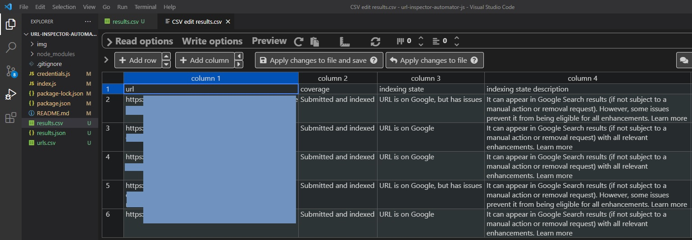

<div>
  

# Google Search Console URL Inspection Automator

This script allows you to extract information programatically from Google Search Console's [URL Inspection Tool](https://support.google.com/webmasters/answer/9012289?hl=en).

The script is based on the original [URL Inspector Automator for Python from Hamlet Batista](https://github.com/ranksense/url-inspector-automator).

## Usage

Clone this repository in your machine using git, Github's CLI or by manually dowloading it.

```bash
git clone https://github.com/jlhernando/url-inspector-automator-js.git

# OR also

gh repo clone https://github.com/jlhernando/url-inspector-automator-js
```

## Settings

The mechanism of the script is quite simple. First, install the neccessary modules from your terminal

```bash
npm install
```

There are two files that you need for the script to work:

1. Update the “urls.csv” file with a list of urls from a site that it’s verified in your Google Search Console account.
2. Update the “credentials.js” file with the email address you use for Search Console, the password and the URL from the property you’d like to check.

   2.1 If you wish to check a domain property instead of a URL property set the `site` variable to: `sc-domain:yoursite.com`


By default, the script runs in headless mode, but if you’d like to see the script in action, simply change the variable `makeHeadless` in line 11 of the index.js file to `false`.

```js
const makeHeadless = false;
```

Once you have edited those files start the script using npm start

```bash
npm start
```

## Output

When the script has finished, you will see two new files in your folder: a “results.csv” and a results.json”.



Both files will contain the following information but in different formats for convenience:

- The Coverage category.
- The index state of your URL as reported by GSC.
- The description of the index state.
- The last reported date & time Googlebot crawled your URL.
- If the URL was found in your XML sitemap.
- The referring pages Googlebot found linking to your URL.
- The Canonical URL declared by the canonical tag in your page (if any).
- The Canonical URL Google has chosen.

If you have exceeded your 100 URLs quota per property, per day (Search Console limitation) you will also get a screenshot of the message and the script will stop.
